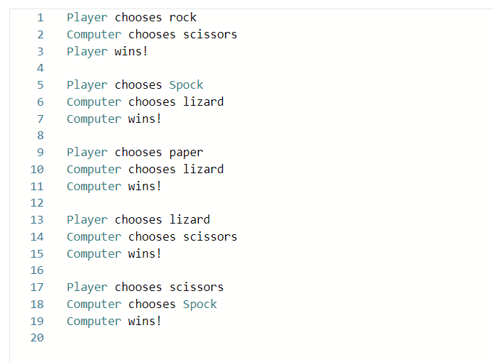

# Rock-paper-scissors-lizard-Spock

## Description
Rock-paper-scissors is a hand game that is played by two people. The players count to three in unison and simultaneously "throw”  one of three hand signals that correspond to rock, paper or scissors. The winner is determined by the rules:  

- Rock smashes scissors  
- Scissors cuts paper  
- Paper covers rock  

Rock-paper-scissors-lizard-Spock (RPSLS) is a variant of Rock-paper-scissors that allows five choices. Each choice wins against two other choices, loses against two other choices and ties against itself.  

## Prerequisites
- Python (v2.6.0)

## Installation
```
- Download python 2.6 interpreter and install in the root directory.
- Set environment variable to point to location of python.exe. 
- Open a terminal and issue the following command to run the rpsls.py script:

python rpsls.py

```

## Image
The output of running the program should have the following form:

## Rock-paper-scissors-lizard-Spock


## Authors
Uchenna Obicheta: [GitHub Profile](https://github.com/uobie80)